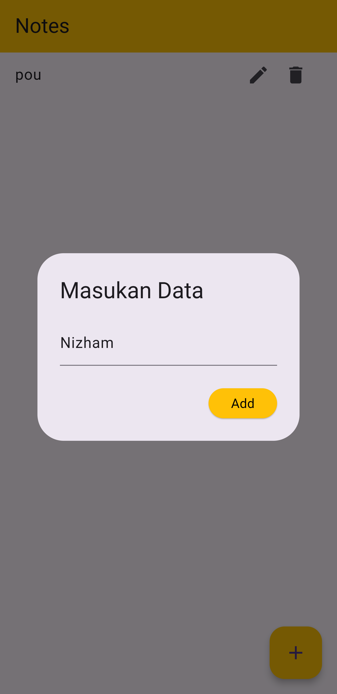

# Simple CRUD menggunakan Flutter dan Firebase

Tugas E-Learning Pemrograman Mobile 2

## Berikut Screenshoot aplikasi 

1. Halaman Utama
   
   Halaman utama ini menampilkan data-data yang di inputkan
   

3. Pop Up Add/Update
   
   Pop Up ini berfungsi untuk menginputkan data dan mengedit data
  
